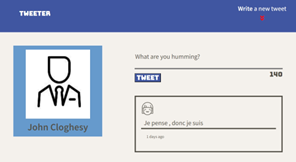
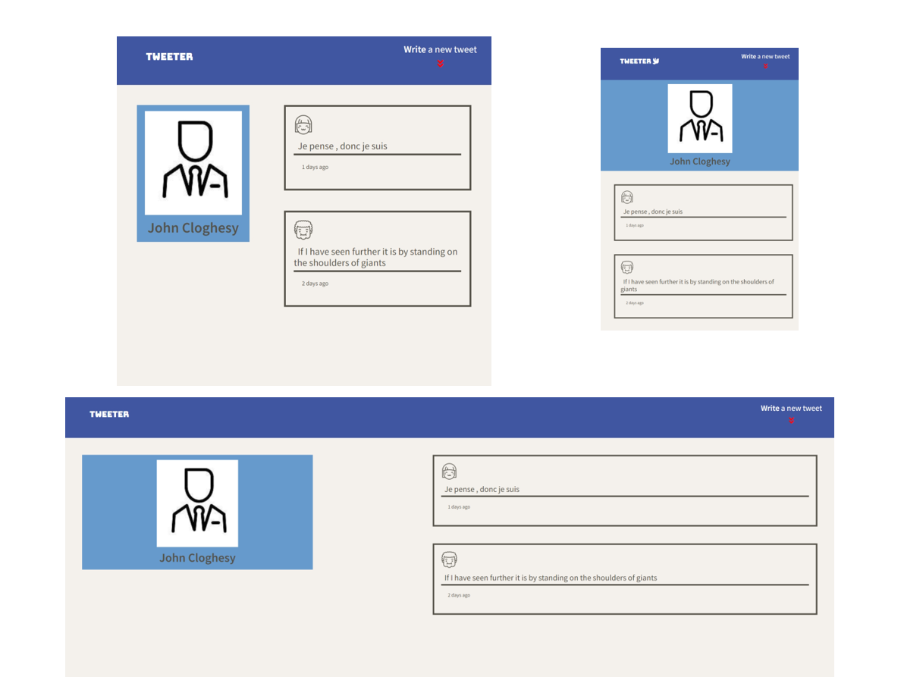
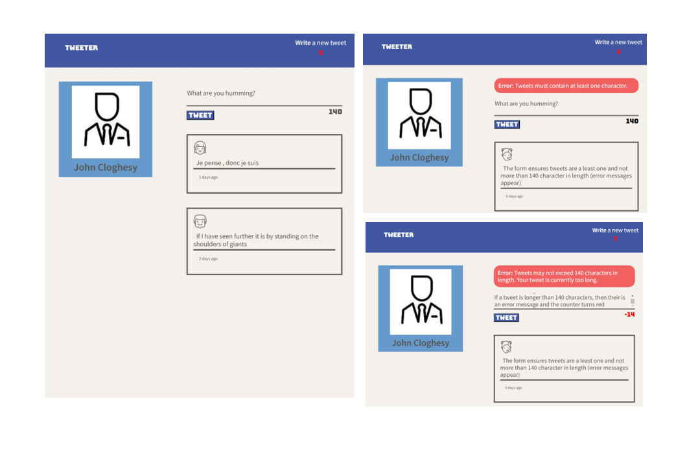

# TWEETER PROJECT


# INTRODUCTION
Tweeter is a simple, single-page Twitter clone that allows users to post tweets and then view their posts in real time.



This project is built on the [tweeter template][tweeter template]
supplied by [lighthouse labs][Lighthouse Labs - GitHub]


# TABLE OF CONTENT

- [USAGE](#usage)
- [FEATURES](#features)
- [FILE STRUCTURE](#file-structure)
- [CREDIT](#credit)

&nbsp;


# USAGE

### DEPENDENCIES
    
| Home Page               | Repository               |
|  :--:                   |  :--:                    |
|  [Node.js][node.org]    |  [`Node.js`][node.git]   | <br>
|  [Express][express.git] |  [`Express`][express.git]| <br>
|  [EJS][ejs.org]         |  [`EJS`][ejs.npmjs]      | <br>
 

### INSTALLATION: REPOSITORY & DEPENDENCIES
  
  1. Repository Cloning 
      - Clone this repository onto your local device using the following command <br>
        ``` 
        git clone https://github.com/Jcloghesy/tweeter/commits/master
        ```
 1. Dependencies Installed
      - Install dependencies with the following command <br>
        ```
        npm install
        ```
### LAUNCH WEB SERVER & VIEW IN BROWSER

  1. Launch Web Sever 
      - Start the application's web server using the following command
        ```
        npm start
        ```
  
  2. Launch Browser
      - View he following link in browser to access application <br>
        http://localhost:8080/
      


***[back to top](#table-of-content)***
&nbsp;


# FEATURES

### Displays Former Tweets with Responsive Design

  - Displays all historical tweets with most recent at top of list
  - The web page adjusts layout depending upon screen size (Breakpoint: 850 px)
  - Three of sceen layouts shows below (desktop, small/narrow & large/wide)
  

&nbsp;

### Form Validation and Display of Error Messages

- When a user submits a valid tweet, the new tweet is displayed 
- When a user submits an invalid tweet (empty or contains more than 140 characters), an 
  error message is displayed.

  
&nbsp;

# FILE AND FOLDERS 

<pre>
📦tweeter
 ┣ 📂docs
 ┣ 📂public
 ┃ ┣ 📂images
 ┃ ┃ ┗ 📜profile-hex.png
 ┃ ┣ 📂scripts
 ┃ ┃ ┣ 📜buttons.js
 ┃ ┃ ┗ 📜load-tweets-submit-tweet.js
 ┃ ┣ 📂styles
 ┃ ┃ ┣ 📜header.css
 ┃ ┃ ┣ 📜layout.css
 ┃ ┃ ┣ 📜nav.css
 ┃ ┃ ┣ 📜new-tweet-form.css
 ┃ ┃ ┣ 📜scroll-to-top.css
 ┃ ┃ ┗ 📜tweets.css
 ┃ ┗ 📜index.html
 ┣ 📂sass
 ┃ ┣ 📜_mixins.scss
 ┃ ┣ 📜_variables.scss
 ┃ ┣ 📜header.scss
 ┃ ┣ 📜layout.scss
 ┃ ┣ 📜nav.scss
 ┃ ┣ 📜new-tweet-form.scss
 ┃ ┣ 📜scroll-to-top.scss
 ┃ ┗ 📜tweets.scss
 ┣ 📂server
 ┣ 📜.gitignore
 ┣ 📜README.md
 ┣ 📜package-lock.json
 ┗ 📜package.json
</pre>

[back to top](#table-of-content)
&nbsp;


## Credits
- [Favicons](https://www.flaticon.com/premium-icon/twitter_3025545) made by [Freepik](https://www.freepik.com) from [www.flaticon.com](https://www.flaticon.com/)
- [`<cdnjs>`][<cdnjs>] cdnjs.com service
  
&nbsp;

<!-- REFERENCE LINKS -->

<!-- Dependencies -->  
  [node.org]: https://nodejs.org/en
  [node.git]: https://github.com/nodejs/node
  [express.org]: https://expressjs.com/  
  [express.git]: https://github.com/expressjs/express  
  [ejs.org]: https://ejs.co/
  [ejs.npmjs]: https://www.npmjs.com/package/ejs
  [nodemon.org]: https://nodemon.io/
  [nodemon.git]: https://github.com/remy/nodemon
 
<!-- Additional Website Links -->
[Lighthouse Labs - GitHub]: https://github.com/lighthouse-labs
[tweeter template]: https://github.com/lighthouse-labs/tweeter
[<cdnjs>]: https://cdnjs.com/

<!-- Images - Screen Captures & Logos, etc  -->
[mainMedium]: /docs/mainMedium.png
[mainNarrow]: /docs/mainNarrow.png
[mainWide]: /docs/mainWide.png
[tweetErrNoChar]: /docs/tweetErrNoChar.png
[tweetErrTooLong]: /docs/tweetErrTooLong.png
[tweetform]: /docs/tweetform.png
